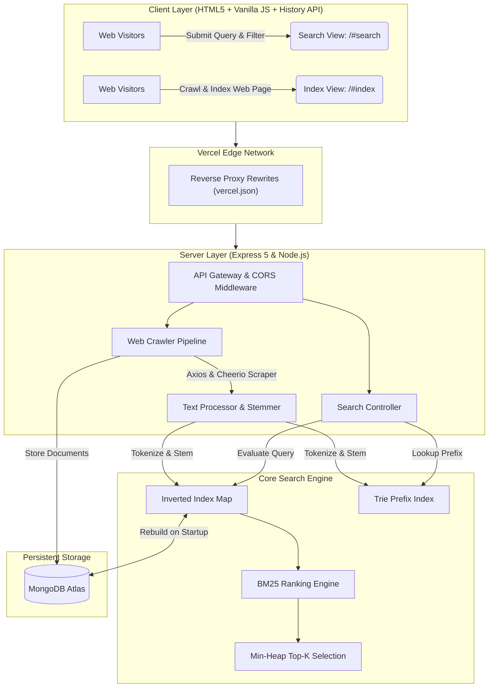

<div align="center">

# Search Engine — MERN & Inverted Index Web Search Engine

**A production-grade, full-stack web search engine with Okapi BM25 relevance scoring, in-memory inverted index, Trie autocomplete, and recursive web crawler.**

[](https://search-engine-henna.vercel.app)
[](LICENSE)

<br/>

[](https://developer.mozilla.org/en-US/docs/Web/JavaScript)
[](https://nodejs.org)
[](https://expressjs.com)
[](https://www.mongodb.com/atlas)
[](https://render.com)
[](https://vercel.com)
[](https://cheerio.js.org/)

<br/>

[Explore Live Demo](https://search-engine-henna.vercel.app) · [Report Bug](https://github.com/kalpitagrawal/SearchEngine/issues) · [Request Feature](https://github.com/kalpitagrawal/SearchEngine/issues)

</div>

<br/>

---

## Live Deployment

- **Frontend:** [https://search-engine-henna.vercel.app](https://search-engine-henna.vercel.app) (Hosted on Vercel)
- **Backend API:** Hosted on [Render](https://searchengine-e8uv.onrender.com) (Node.js Web Service + MongoDB Atlas Cloud Database)

---

## Table of Contents

- [Key Features](#key-features)
- [System Architecture](#system-architecture)
- [Tech Stack](#tech-stack)
- [Algorithmic & Engineering Specifications](#algorithmic--engineering-specifications)
- [Project Structure](#project-structure)
- [API Documentation](#api-documentation)
- [Getting Started Locally](#getting-started-locally)
  - [Prerequisites](#prerequisites)
  - [1. Clone Repository](#1-clone-repository)
  - [2. Configuration](#2-configuration)
  - [3. Start Development Server](#3-start-development-server)
- [Deployment Guide](#deployment-guide)
- [Contributing](#contributing)
- [Author and License](#author-and-license)

---

## Key Features

- **Okapi BM25 Relevance Scoring Engine**: Calculates document relevance using term frequency saturation ($k_1 = 1.5$), document length normalization ($b = 0.75$), and Robertson $+1$ smoothed Inverse Document Frequency.
- **Trie-Based Prefix Autocomplete**: In-memory prefix tree implementation for sub-millisecond query suggestions and search term completion.
- **Porter Stemming Algorithm**: Suffix-stripping algorithm normalizing morphological variants (e.g., "running" $\rightarrow$ "run") to optimize recall.
- **Min-Heap Top-K Priority Queue**: Selection algorithm retrieving top-$K$ candidate documents in $O(N \log K)$ time complexity without fully sorting candidate sets.
- **Single & Recursive Web Crawler**: HTML scraping pipeline powered by Axios and Cheerio, filtering non-content markup (`script`, `style`, `nav`, `footer`, `ads`), resolving relative links, and executing depth-controlled recursive crawls.
- **In-Memory Inverted Index**: `Map<token, PostingList>` structure paired with document length tracking for instantaneous document lookup.
- **Dual Database Architecture**: Supports local disk-backed storage via WiredTiger (`mongodb-memory-server`) for offline development and MongoDB Atlas for cloud persistence.
- **Startup Index Reconstruction**: Automatically reconstructs the in-memory inverted index from MongoDB upon server startup.

---

## System Architecture



---

## Tech Stack

### Frontend
- **Interface:** HTML5, Vanilla JavaScript (ES6+), Fetch API, HTML5 History API
- **Design System:** Custom CSS3 Glassmorphism UI, JetBrains Mono Typography

### Backend
- **Runtime:** [Node.js](https://nodejs.org/) (ES Modules)
- **Framework:** [Express 5](https://expressjs.com/)
- **Database ODM:** [Mongoose 9](https://mongoosejs.com/) (MongoDB Atlas)
- **HTML Scraper:** [Cheerio](https://cheerio.js.org/), [Axios](https://axios-http.com/)
- **Middleware:** `cors`, `cookie-parser`, `dotenv`

### Core Algorithms
- **Data Structures:** Custom Inverted Index (`PostingList`), Min-Heap Priority Queue, Prefix Trie
- **Text Processing:** Porter Stemmer, Stop-words Filter, Regex Tokenizer
- **Ranking Model:** Okapi BM25

---

## Algorithmic & Engineering Specifications

### 1. Okapi BM25 Ranking Formulation

Document relevance scoring is calculated per query term $q_i$ against candidate document $D$:

$$\text{Score}(D, Q) = \sum_{i=1}^{n} \text{IDF}(q_i) \cdot \frac{f(q_i, D) \cdot (k_1 + 1)}{f(q_i, D) + k_1 \cdot \left(1 - b + b \cdot \frac{|D|}{\text{avgdl}}\right)}$$

Where:
- $k_1 = 1.5$: Term frequency saturation parameter.
- $b = 0.75$: Document length normalization scaling parameter.
- $\text{IDF}(q_i) = \log_{10}\left(1 + \frac{N}{df_i}\right)$: Robertson $+1$ smoothed Inverse Document Frequency.
- $|D|$: Length of target document $D$ in total terms.
- $\text{avgdl}$: Average term length across all indexed documents in the collection.

### 2. Min-Heap Top-K Selection

Instead of executing a global array sort ($O(N \log N)$) over all matched documents $N$, candidates pass through a bounded Min-Heap of capacity $K$. The priority queue maintains only the top-$K$ highest scoring results, reducing retrieval complexity to $O(N \log K)$.

---

## Project Structure

```text
SearchEngine/
├── public/
│   ├── app.js               # Frontend router, state manager, and view engine
│   ├── index.html           # Single-page application markup
│   └── style.css            # Custom glassmorphic styling & typography
├── src/
│   ├── controllers/
│   │   └── search.controller.js  # HTTP route controllers
│   ├── crawler/
│   │   └── WebCrawler.js    # Axios & Cheerio scraping engine
│   ├── db/
│   │   └── index.js         # MongoDB connection & local database manager
│   ├── engine/
│   │   ├── InvertedIndex.js # Inverted index data structure
│   │   ├── MinHeap.js       # Priority queue for top-K candidate extraction
│   │   ├── PorterStemmer.js # Suffix-stripping stemming implementation
│   │   ├── PostingList.js   # Frequency posting list map
│   │   ├── RankingEngine.js # BM25 scoring algorithm
│   │   ├── SearchEngine.js  # Search & indexing orchestrator
│   │   ├── SearchResult.js  # Result model container
│   │   ├── TextProcessor.js # Tokenizer, stop-word removal & stemmer
│   │   └── Trie.js          # Prefix tree data structure for autocomplete
│   ├── models/
│   │   └── document.model.js# Mongoose document schema
│   ├── routes/
│   │   └── search.routes.js # Express API endpoints
│   ├── services/
│   │   └── search.service.js# Business logic & startup index rebuild logic
│   ├── app.js               # Express application configuration
│   ├── constants.js         # Database & app constants
│   └── index.js             # Server entry point
├── .env                     # Local environment configuration
├── vercel.json              # Vercel deployment & API rewrite config
├── package.json
└── README.md
```

---

## API Documentation

Base URL: `/api`

### 1. Execute Search Query (`GET /api/search`)

Query the inverted index, evaluate BM25 relevance scores, and return ranked document results.

| Parameter | Type | Required | Default | Description |
|---|---|---|---|---|
| `q` | `string` | Yes | - | Search query text (e.g., `react state`) |
| `topK` | `number` | No | `50` | Maximum candidate heap capacity |
| `page` | `number` | No | `1` | Pagination page number |
| `limit` | `number` | No | `10` | Results per page |
| `domain` | `string` | No | `all` | Filter results by domain |

#### Sample Response:
```json
{
  "query": "react",
  "totalResults": 1,
  "totalPages": 1,
  "currentPage": 1,
  "results": [
    {
      "documentId": "https://react.dev/",
      "score": 0.7306,
      "title": "React",
      "snippet": "React - The library for web and native user interfaces..."
    }
  ]
}
```

---

### 2. Index Web Page (`POST /api/index`)

Crawl a target URL, extract text, store document record in MongoDB, and update inverted index.

#### Request Body:
```json
{
  "url": "https://react.dev/",
  "maxDepth": 1,
  "maxPages": 1
}
```

#### Sample Response:
```json
{
  "status": "indexed",
  "url": "https://react.dev/",
  "title": "React",
  "tokensIndexed": 908,
  "childLinksFound": 60
}
```

---

### 3. Autocomplete Suggestions (`GET /api/suggest`)

Query the in-memory Trie index for matching term prefixes.

| Parameter | Type | Required | Default | Description |
|---|---|---|---|---|
| `q` | `string` | Yes | - | Term prefix string |
| `limit` | `number` | No | `5` | Maximum suggestions |

#### Sample Response:
```json
{
  "prefix": "rea",
  "suggestions": ["react", "reading", "realtime"]
}
```

---

### 4. Index Metrics (`GET /api/stats`)

Retrieve live system metrics from the in-memory inverted index and database.

#### Sample Response:
```json
{
  "totalDocuments": 15,
  "totalTerms": 4820,
  "averageDocumentLength": 1240,
  "documentsInDatabase": 15
}
```

---

## Getting Started Locally

### Prerequisites

- **Node.js**: v18.x or higher
- **npm**: v9.x or higher

### 1. Clone Repository

```bash
git clone https://github.com/kalpitagrawal/SearchEngine.git
cd SearchEngine
```

### 2. Configuration

Create a local environment file `.env`:

```env
PORT=8080
CORS_ORIGIN=*
USE_MEMORY_DB=true
CRAWLER_TIMEOUT_MS=10000
CRAWLER_USER_AGENT=SearchEngineBot/1.0
```

*(Setting `USE_MEMORY_DB=true` uses `mongodb-memory-server` backed by local disk storage at `./data/db`, requiring no external database installation for development).*

### 3. Start Development Server

```bash
npm install
npm run dev
```

Open `http://localhost:8080` in your browser.

---

## Deployment Guide

### Deploying Backend to Render
1. Create a new **Web Service** on [Render](https://render.com) connected to your GitHub repository.
2. Configure settings:
   - **Root Directory:** Leave empty (or `./`)
   - **Environment:** `Node`
   - **Build Command:** `npm install`
   - **Start Command:** `npm start`
3. Configure Environment Variables in Render Dashboard:
   - `USE_MEMORY_DB`: `false`
   - `MONGO_URI`: `your_mongodb_atlas_connection_string`
   - `CORS_ORIGIN`: `*`
   - `PORT`: `8080`

### Deploying Frontend to Vercel
1. In the [Vercel Dashboard](https://vercel.com), select **"New Project"**.
2. Import your repository and set:
   - **Framework Preset:** `Other`
   - **Output Directory:** `public`
3. Click **Deploy**. Vercel will proxy `/api/*` requests to your Render backend via [`vercel.json`](vercel.json).

---

## Contributing

Contributions, issues, and feature requests are welcome. Feel free to check the [issues page](https://github.com/kalpitagrawal/SearchEngine/issues).

1. Fork the repository
2. Create a feature branch (`git checkout -b feature/improvement`)
3. Commit your changes (`git commit -m 'feat: add feature'`)
4. Push to the branch (`git push origin feature/improvement`)
5. Open a Pull Request

---

## Author and License

**Kalpit Agrawal**
- GitHub: [@kalpitagrawal](https://github.com/kalpitagrawal)

This project is licensed under the **MIT License**.
