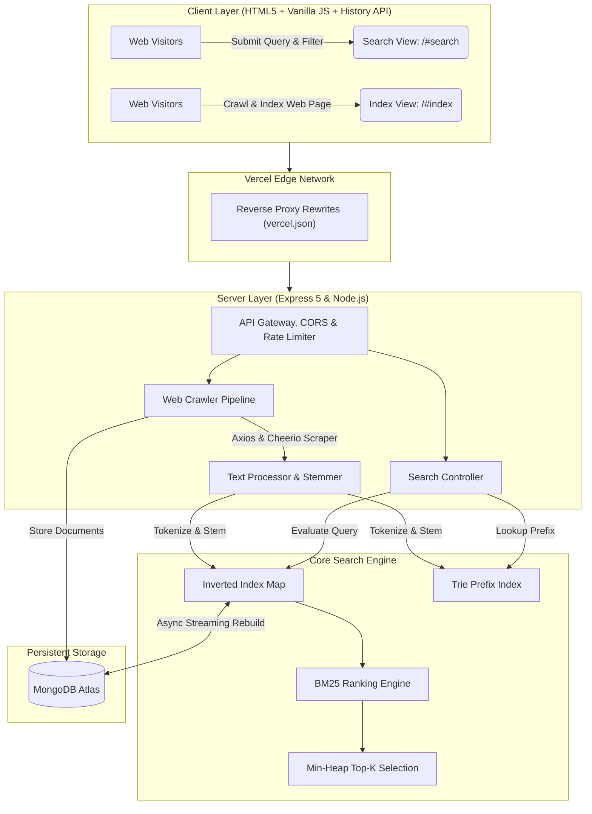

<div align="center">

# NexusSearch — Full-Stack BM25 Web Search Engine

**A production-grade, full-stack web search engine with Okapi BM25 relevance scoring, in-memory inverted index, bounded Trie autocomplete, and depth-limited BFS web crawler.**

[](https://search-engine-henna.vercel.app)
[](LICENSE)

<br/>

[](https://developer.mozilla.org/en-US/docs/Web/JavaScript)
[](https://nodejs.org)
[](https://expressjs.com)
[](https://www.mongodb.com/atlas)
[](https://render.com)
[](https://vercel.com)
[](https://cheerio.js.org/)

<br/>

[Explore Live Demo](https://search-engine-henna.vercel.app) · [Report Bug](https://github.com/kalpitagrawal/NexusSearch/issues) · [Request Feature](https://github.com/kalpitagrawal/NexusSearch/issues)

</div>

<br/>

---

## Live Deployment

- **Frontend:** [https://search-engine-henna.vercel.app](https://search-engine-henna.vercel.app) (Hosted on Vercel)
- **Backend API:** Hosted on [Render](https://searchengine-e8uv.onrender.com) (Node.js Web Service + MongoDB Atlas Cloud Database)

---

## Table of Contents

- [Key Features](#key-features)
- [System Architecture](#system-architecture)
- [Tech Stack](#tech-stack)
- [Algorithmic & Engineering Specifications](#algorithmic--engineering-specifications)
- [Project Structure](#project-structure)
- [API Documentation](#api-documentation)
- [Testing & Verification](#testing--verification)
- [Benchmarking](#benchmarking)
- [Getting Started Locally](#getting-started-locally)
- [Deployment Guide](#deployment-guide)
- [Contributing](#contributing)
- [Author and License](#author-and-license)

---

## Key Features

- **Okapi BM25 Relevance Scoring Engine**: Evaluates candidate relevance using term frequency saturation ($k_1 = 1.5$), document length normalization ($b = 0.75$), and standard BM25 smoothed Inverse Document Frequency with non-negative smoothing floors.
- **Trie-Based Prefix Autocomplete**: Prefix tree indexing unstemmed vocabulary words with document frequencies. Uses a size-bounded min-heap during prefix traversal to deliver verified microsecond-level query suggestions.
- **Porter Stemming Algorithm**: Suffix-stripping algorithm normalizing morphological variants (e.g., "running" $\rightarrow$ "run") to optimize index recall.
- **Min-Heap Top-K Priority Queue**: Retrieves top-$K$ candidate documents in $O(N \log K)$ time (where $N$ is the number of matching candidate documents), with precomputed term IDFs and $O(1)$ average document length calculations.
- **Depth-Limited Iterative BFS Web Crawler**: Queue-driven crawler with visited-set URL deduplication, URL normalization, semantic HTML tag filtering, Content-Type enforcement (`text/html`), and SSRF defenses (preventing DNS rebinding and blocking private/carrier-grade NAT IP ranges).
- **In-Memory Inverted Index**: Positional `Map<token, PostingList>` structure paired with incremental length tracking and atomic index swapping during background rebuilds.
- **Dual Database Architecture**: Supports local disk-backed storage via WiredTiger (`mongodb-memory-server`) for offline development and MongoDB Atlas for cloud persistence.
- **Streaming Startup Index Reconstruction**: Reconstructs the in-memory inverted index asynchronously via streaming Mongoose cursors without blocking port binding or event loop execution.

---

## System Architecture


```mermaid
flowchart TD
    subgraph Client ["Client Layer (HTML5 + Vanilla JS + History API)"]
        A[Web Visitors] -->|Submit Query & Filter| B(Search View: /#search)
        C[Web Visitors] -->|Crawl & Index Web Page| D(Index View: /#index)
    end

    subgraph CDN ["Vercel Edge Network"]
        SPA["Reverse Proxy Rewrites (vercel.json)"]
    end

    subgraph Backend ["Server Layer (Express 5 & Node.js)"]
        E[API Gateway, CORS & Rate Limiter]
        F[Search Controller]
        G[Web Crawler Pipeline]
        H[Text Processor & Stemmer]
    end

    subgraph Engine ["Core Search Engine"]
        I[Inverted Index Map<token, PostingList>]
        J[Trie Prefix Index]
        K[BM25 Ranking Engine]
        L[Min-Heap Top-K Selection]
    end

    subgraph Database ["Persistent Storage"]
        M[(MongoDB Atlas)]
    end

    Client --> CDN --> Backend
    E --> F & G
    G -->|Axios & Cheerio Scraper| H
    H -->|Tokenize & Stem| I & J
    F -->|Lookup Prefix| J
    F -->|Evaluate Query| I --> K --> L
    G -->|Store Documents| M
    I <-->|Async Streaming Rebuild| M
```

---

## Tech Stack

### Frontend
- **Interface:** HTML5, Vanilla JavaScript (ES6+), Fetch API, HTML5 History API
- **Design System:** Custom CSS3 Glassmorphism UI, JetBrains Mono Typography

### Backend
- **Runtime:** [Node.js](https://nodejs.org/) (ES Modules)
- **Framework:** [Express 5](https://expressjs.com/)
- **Database ODM:** [Mongoose 9](https://mongoosejs.com/) (MongoDB Atlas)
- **HTML Scraper:** [Cheerio](https://cheerio.js.org/), [Axios](https://axios-http.com/)
- **Middleware & Security:** `cors`, `express-rate-limit`, `ipaddr.js`, `dotenv`

### Core Algorithms
- **Data Structures:** Custom Inverted Index (`PostingList`), Min-Heap Priority Queue, Prefix Trie
- **Text Processing:** Porter Stemmer, Stop-words Filter, Regex Tokenizer
- **Ranking Model:** Okapi BM25 with exact phrase adjacency boost

---

## Algorithmic & Engineering Specifications

### 1. Okapi BM25 Ranking Formulation

Document relevance scoring is calculated per query term $q_i$ against candidate document $D$:

$$\text{Score}(D, Q) = \sum_{i=1}^{n} \text{IDF}(q_i) \cdot \frac{f(q_i, D) \cdot (k_1 + 1)}{f(q_i, D) + k_1 \cdot \left(1 - b + b \cdot \frac{|D|}{\text{avgdl}}\right)}$$

Where:
- $k_1 = 1.5$: Term frequency saturation parameter.
- $b = 0.75$: Document length normalization scaling parameter.
- $\text{IDF}(q_i) = \ln\left(1 + \frac{N_{\text{total}} - df_i + 0.5}{df_i + 0.5}\right)$: Standard BM25 smoothed Inverse Document Frequency. The $+1$ smoothing floor guarantees term weights remain non-negative even when $df_i > N_{\text{total}} / 2$.
- $|D|$: Number of terms in document $D$.
- $\text{avgdl}$: Average document length across the collection, maintained incrementally in $O(1)$ time upon insertions.

### 2. Min-Heap Top-K Selection

Instead of executing a global array sort ($O(N \log N)$), candidate documents matching query tokens ($N$) pass through a size-bounded Min-Heap of capacity $K = \text{page} \times \text{limit}$. 

Query term IDFs and average document length are precalculated once before scoring, ensuring candidate scoring and heap retrieval runs in $O(N \log K)$ time complexity (where $N$ is the number of matching candidate documents, not total corpus size). Deep pagination is accommodated by sizing the heap to the requested page depth.

### 3. Trie Prefix Autocomplete

The Trie indexes natural, unstemmed vocabulary words paired with document frequencies. During autocomplete traversal (`getSuggestions(prefix, maxResults)`), the engine uses a bounded min-heap during depth-first traversal of the prefix subtree, avoiding unbounded array allocations. Autocomplete query latencies are verified at microsecond speed (mean ~3.3 µs via `npm run benchmark`).

### 4. Depth-Limited Iterative BFS Web Crawler & SSRF Defenses

The crawler fetches pages using a queue-based Breadth-First Search (FIFO queue and `visited` Set), bounded by configurable depth and page ceilings.

**Security & Politeness Defenses:**
- **SSRF & DNS Rebinding Protection:** Uses a custom DNS lookup function on Node's HTTP/HTTPS agents that resolves and validates IP addresses at socket connection time. Rejects loopback (`127.0.0.0/8`, `::1`), cloud metadata (`169.254.169.254`), private networks (`10.0.0.0/8`, `172.16.0.0/12`, `192.168.0.0/16`), carrier-grade NAT (`100.64.0.0/10`), IPv4-mapped IPv6 (`::ffff:127.0.0.1`), and local domains.
- **Redirect Validation:** Re-evaluates each target URL on redirects (`beforeRedirect`).
- **Content-Type & Size Enforcement:** Rejects non-HTML documents (`Content-Type` must contain `text/html`) and caps responses at 5 MB.
- **URL Normalization:** Normalizes trailing slashes, lowercases hostnames, and strips tracking query parameters (`utm_*`, `fbclid`).

### 5. Architectural Boundaries & Scaling Notes

NexusSearch operates an in-process, memory-resident inverted index designed for ultra-low latency single-node retrieval. 
- **Multi-Instance Scaling:** In multi-node deployments (e.g., horizontally scaled containers), worker instances can synchronize their in-memory index state via MongoDB Change Streams or a shared Redis cache layer.
- **Crawler Politeness:** An optional same-domain restriction is supported; adherence to `robots.txt` protocol is documented for future production extensions.

---

## Project Structure

```text
NexusSearch/
├── public/
│   ├── app.js               # Frontend router, state manager, and view engine
│   ├── index.html           # Single-page application markup
│   └── style.css            # Custom glassmorphic styling & typography
├── src/
│   ├── controllers/
│   │   └── search.controller.js  # HTTP route controllers with semantic error mapping
│   ├── crawler/
│   │   └── WebCrawler.js    # Hardened BFS crawling engine with SSRF guards
│   ├── db/
│   │   └── index.js         # MongoDB connection & local database manager
│   ├── engine/
│   │   ├── InvertedIndex.js # Inverted index data structure with embedded Trie & O(1) length tracking
│   │   ├── PorterStemmer.js # Suffix-stripping stemming implementation
│   │   ├── PostingList.js   # Positional posting list map
│   │   ├── RankingEngine.js # BM25 scoring algorithm & Min-Heap priority queue
│   │   ├── SearchEngine.js  # Search & candidate retrieval facade
│   │   ├── SearchResult.js  # Result model container
│   │   ├── TextProcessor.js # Tokenizer, stop-word filter, stemmer, and word extractor
│   │   └── Trie.js          # Prefix tree data structure for autocomplete
│   ├── models/
│   │   └── document.model.js# Mongoose document schema with indexed documentId
│   ├── routes/
│   │   └── search.routes.js # Express API endpoints with crawl rate limiting
│   ├── services/
│   │   └── search.service.js# Business logic, streaming rebuild, and batch enrichment
│   ├── utils/
│   │   ├── ApiError.js      # Structured HTTP error representation
│   │   └── ssrfFilter.js    # IP blocklist and safe DNS lookup agents
│   ├── app.js               # Express application configuration & health checks
│   ├── constants.js         # Database & app constants
│   └── index.js             # Server entry point with non-blocking startup
├── tests/                   # Node test runner unit tests
│   ├── bm25.test.js
│   ├── heap.test.js
│   ├── phrase.test.js
│   ├── ssrf.test.js
│   ├── stemmer.test.js
│   └── trie.test.js
├── scripts/
│   └── benchmark.js         # Reproducible algorithmic performance benchmark
├── .env                     # Local environment configuration
├── vercel.json              # Vercel deployment & API rewrite config
├── package.json
└── README.md
```

---

## API Documentation

Base URL: `/api`

### 1. Execute Search Query (`GET /api/search`)

Query the inverted index, evaluate BM25 relevance scores, calculate domain facets across all matching candidates, and return paginated results.

| Parameter | Type | Required | Default | Description |
|---|---|---|---|---|
| `q` | `string` | Yes | - | Search query text (e.g., `react state`) |
| `topK` | `number` | No | `50` | Maximum candidate heap capacity |
| `page` | `number` | No | `1` | Pagination page number |
| `limit` | `number` | No | `10` | Results per page |
| `domain` | `string` | No | `all` | Filter results by domain |

### 2. Index Web Page (`POST /api/index`)

Crawl a target URL, extract text, store document record in MongoDB, and update inverted index. Rate-limited to 10 requests per 15 minutes per IP.

| Field | Type | Required | Default | Description |
|---|---|---|---|---|
| `url` | `string` | Yes | - | Target web page URL to crawl |
| `maxDepth` | `number` | No | `1` | Max BFS crawl depth (capped at 2 in demo) |
| `maxPages` | `number` | No | `1` | Max pages to index (capped at 5 in demo) |
| `sameDomainOnly` | `boolean` | No | `false` | Restrict child link crawl to originating domain |

### 3. Autocomplete Suggestions (`GET /api/suggest`)

Query the in-memory Trie index for matching term prefixes.

| Parameter | Type | Required | Default | Description |
|---|---|---|---|---|
| `q` | `string` | Yes | - | Term prefix string |
| `limit` | `number` | No | `5` | Maximum suggestions |

### 4. Index Metrics (`GET /api/stats`)

Retrieve live system metrics from the in-memory inverted index and database.

### 5. Health Check (`GET /api/health`)

Returns uptime and index readiness status for container health monitoring.

---

## Testing & Verification

Run the automated test suite using Node.js built-in test runner:

```bash
npm test
```

Suite covers:
- **Porter Stemmer**: morphological variants, plurals, past tense, and edge-case inputs.
- **Min-Heap**: root ordering, poll order, and top-K bounded capacity.
- **Trie Prefix Tree**: real vocabulary suggestions, frequency ordering, and maxResults limits.
- **BM25 Scoring**: relevance ordering, term frequency saturation, and $O(1)$ average document length calculations.
- **Phrase Search**: positional index adjacency and quoted search boosts.
- **SSRF Filter**: IPv4/IPv6 private ranges, loopback, IPv4-mapped IPv6, carrier-grade NAT, and URL scheme validation.

---

## Benchmarking

Run the reproducible algorithmic performance benchmark script:

```bash
npm run benchmark
```

Benchmark output on synthetic corpus (100 documents, 30,000 words):
- **Indexing Throughput:** 100 documents with full positional index in ~40 ms.
- **Trie Autocomplete Latency:** Mean latency **~3.3 µs** (0.0033 ms), p99 **~10.3 µs** (0.0103 ms).
- **BM25 Search + Min-Heap Top-10:** Mean latency **~0.04 ms**, p99 **~0.29 ms**.

---

## Getting Started Locally

### Prerequisites

- **Node.js**: v18.x or higher
- **npm**: v9.x or higher

### 1. Clone Repository

```bash
git clone https://github.com/kalpitagrawal/NexusSearch.git
cd NexusSearch
```

### 2. Configuration

Create a local environment file `.env`:

```env
PORT=8080
CORS_ORIGIN=*
USE_MEMORY_DB=true
CRAWLER_TIMEOUT_MS=10000
CRAWLER_USER_AGENT=NexusSearchBot/1.0
```

### 3. Start Development Server

```bash
npm install
npm run dev
```

Open `http://localhost:8080` in your browser.

---

## Deployment Guide

### Deploying Backend to Render
1. Create a new **Web Service** on [Render](https://render.com) connected to your repository.
2. Configure settings:
   - **Build Command:** `npm install`
   - **Start Command:** `npm start`
3. Configure Environment Variables in Render Dashboard:
   - `USE_MEMORY_DB`: `false`
   - `MONGO_URI`: `your_mongodb_atlas_connection_string`
   - `PORT`: `8080`

### Deploying Frontend to Vercel
1. In [Vercel Dashboard](https://vercel.com), select **"New Project"**.
2. Set output directory to `public`.
3. Click **Deploy**. Vercel will proxy `/api/*` requests to your Render backend via [`vercel.json`](vercel.json).

---

## Contributing

Contributions, issues, and feature requests are welcome. Feel free to check the [issues page](https://github.com/kalpitagrawal/NexusSearch/issues).

---

## Author and License

**Kalpit Agrawal**
- GitHub: [@kalpitagrawal](https://github.com/kalpitagrawal)

This project is licensed under the **MIT License**.
